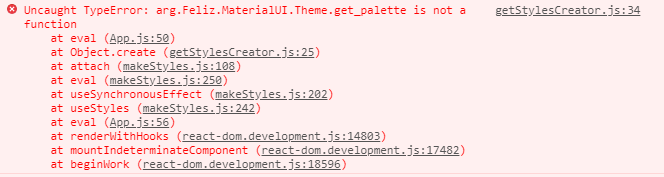
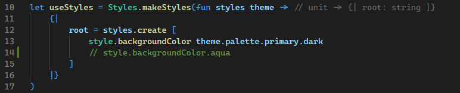

Repo to reproduce Feliz.MaterialUI error using Fable 3.

## Setup
1. Install [.NET Core SDK](https://dotnet.microsoft.com/download)
2. Install tools.
    ```shell
    dotnet tool restore
    ```

## Reproduce
1. Start the web app.
```shell
dotnet fake build -t Start
```
2. Navigate to http://localhost:3000
3. Open up the dev console and you should see a few errors.

    

4. If you comment out line 13 and uncomment line 14 in [App.fs](./src/App/App.fs) then the app will work.

    
